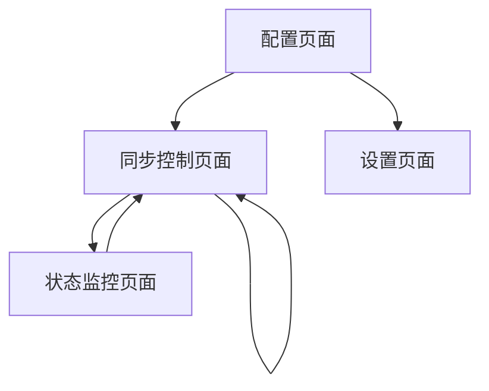

# Zotero to Readwise 插件产品需求文档

## 1. 产品概述

本插件是基于原始Zotero2Readwise Python库的重新设计，旨在为Zotero 7用户提供无缝的注释同步体验。插件直接集成到Zotero客户端中，自动将PDF阅读器中的高亮注释和笔记同步到Readwise平台，无需外部脚本或命令行操作。

该插件解决了学术研究人员和知识工作者在文献阅读过程中注释管理分散的问题，通过自动化同步提升知识管理效率，让用户专注于内容本身而非技术操作。

## 2. 核心功能

### 2.1 用户角色

| 角色 | 注册方式 | 核心权限 |
|------|----------|----------|
| 默认用户 | 插件安装后直接使用 | 配置API密钥、同步注释、查看同步状态 |

### 2.2 功能模块

我们的Zotero to Readwise插件包含以下主要页面：

1. **配置页面**：API密钥设置、同步选项配置、账户验证
2. **同步控制页面**：手动同步触发、自动同步设置、同步历史查看
3. **状态监控页面**：同步进度显示、错误日志查看、统计信息展示
4. **设置页面**：插件偏好设置、高级选项配置

### 2.3 页面详情

| 页面名称 | 模块名称 | 功能描述 |
|----------|----------|----------|
| 配置页面 | API密钥管理 | 输入和验证Readwise访问令牌，测试连接状态 |
| 配置页面 | 同步范围设置 | 选择同步注释类型（高亮、笔记），设置过滤条件 |
| 同步控制页面 | 手动同步 | 一键触发同步操作，显示实时进度 |
| 同步控制页面 | 自动同步配置 | 设置自动同步间隔、触发条件（新增注释时） |
| 同步控制页面 | 同步历史 | 查看历史同步记录、成功失败统计 |
| 状态监控页面 | 进度显示 | 实时显示当前同步进度、处理的文档数量 |
| 状态监控页面 | 错误处理 | 显示同步失败的项目、错误原因、重试选项 |
| 状态监控页面 | 统计信息 | 显示总同步数量、最近同步时间、成功率 |
| 设置页面 | 插件偏好 | 设置界面语言、通知选项、日志级别 |
| 设置页面 | 高级选项 | 配置API请求间隔、批量处理大小、重试策略 |

## 3. 核心流程

用户首次使用插件时，需要在配置页面输入Readwise API令牌并验证连接。配置完成后，可以选择手动同步或启用自动同步。手动同步时，用户点击同步按钮，插件获取Zotero数据库中的注释并上传到Readwise。自动同步模式下，插件会在用户添加新注释或定时触发同步操作。同步过程中，状态监控页面实时显示进度和结果。

## 4. 用户界面设计

### 4.1 设计风格

- **主色调**：#2563eb（蓝色）作为主色，#f8fafc（浅灰）作为背景色
- **按钮样式**：圆角矩形按钮，悬停时有阴影效果
- **字体**：系统默认字体，标题16px，正文14px，说明文字12px
- **布局风格**：卡片式布局，顶部标签页导航
- **图标风格**：使用Zotero内置图标系统，简洁线性图标

### 4.2 页面设计概览

| 页面名称 | 模块名称 | UI元素 |
|----------|----------|--------|
| 配置页面 | API密钥管理 | 输入框（密码类型）、验证按钮（绿色）、状态指示器（圆点） |
| 配置页面 | 同步范围设置 | 复选框组、下拉选择器、说明文字（灰色） |
| 同步控制页面 | 手动同步 | 大型同步按钮（蓝色）、进度条、状态文字 |
| 同步控制页面 | 自动同步配置 | 开关按钮、时间选择器、触发条件复选框 |
| 状态监控页面 | 进度显示 | 环形进度图、数字统计卡片、彩色状态标签 |
| 设置页面 | 插件偏好 | 下拉菜单、滑块控件、开关按钮 |

### 4.3 响应式设计

插件界面采用桌面优先设计，适配Zotero客户端的窗口大小变化。界面元素支持最小宽度320px，确保在较小窗口中仍可正常使用。不涉及触摸交互优化，专注于鼠标和键盘操作体验。