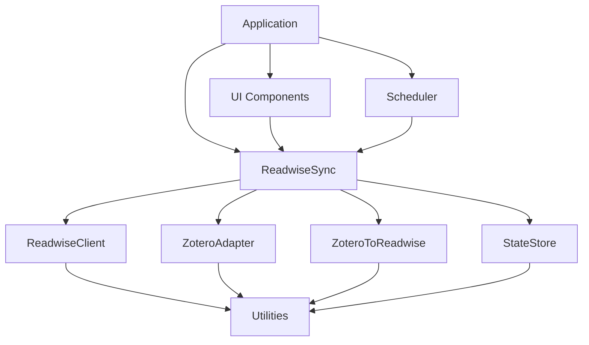

# ZR-Sync Architecture Documentation

## Overview

ZR-Sync (Zotero-Readwise Sync) is a Zotero plugin that synchronizes annotations, highlights, and notes between Zotero and Readwise. Built on a modular architecture with clear separation of concerns, the plugin follows SOLID principles and emphasizes testability and maintainability.

### Key Capabilities

- **Bidirectional Synchronization**: Supports Zotero → Readwise, Readwise → Zotero, and two-way sync
- **Incremental Updates**: Only syncs changed items to minimize API calls and improve performance
- **Batch Processing**: Handles large libraries efficiently with configurable batch sizes
- **Error Recovery**: Automatic retry mechanism with exponential backoff
- **State Management**: Tracks sync history and handles conflicts intelligently

## Architectural Principles

1. **Modular Design**: Each module has a single, well-defined responsibility
2. **UI-Agnostic Core**: Business logic is completely separated from UI concerns
3. **Dependency Injection**: Dependencies are injected via constructors for better testability
4. **Type Safety**: Full TypeScript implementation with strict type checking
5. **Error Handling**: Centralized error handling with structured logging
6. **Plugin Architecture**: Follows Zotero plugin best practices and conventions
7. **Performance First**: Optimized for handling large libraries with minimal resource usage

## Module Structure & ZR Mapping

```
src/
├── core/                      # 核心业务逻辑
│   └── readwiseSync/         # 同步编排器
├── api/                      # 外部 API 客户端
│   └── readwiseClient/       # Readwise API v2 客户端
├── adapters/                 # 数据适配器
│   └── zoteroAdapter/        # Zotero 数据访问层
├── mappers/                  # 数据映射器
│   └── zoteroToReadwise/     # Zotero → Readwise 映射
├── storage/                  # 本地存储
│   └── stateStore/           # 状态和偏好设置管理
├── ui/                       # 用户界面
│   ├── preferences/          # 偏好设置面板
│   ├── toolsMenu/           # Tools 菜单集成
│   └── progressWindow/       # 进度显示窗口
├── tasks/                    # 后台任务
│   └── scheduler/            # 同步调度器
├── utils/                    # 通用工具
│   ├── logger.ts            # 日志记录
│   ├── errors.ts            # 错误处理
│   ├── hash.ts              # 哈希计算
│   ├── chunk.ts             # 数组分块
│   └── debounce.ts          # 防抖/节流
└── app.ts                    # 应用程序引导

```

## Module Dependencies & Data Flow



## Core Module Details

### 1. Core Layer (core/readwiseSync)

**Responsibility**: Orchestrate the entire synchronization workflow

**Key Features**:
- Scan and filter Zotero data based on user preferences
- Coordinate data transformation between formats
- Manage batch uploads to Readwise API
- Handle sync conflicts and deduplication
- Update local sync state and history

**Key Classes**:
- `ReadwiseSyncOrchestrator`: Main synchronization coordinator
- `SyncStrategy`: Different sync strategies (incremental, full, selective)
- `ConflictResolver`: Handles sync conflicts between platforms

**ZR Module Mapping**: This is the central "Z2R" component that bridges Zotero and Readwise

### 2. API Layer (api/readwiseClient)

**Responsibility**: Manage all communication with Readwise API v2

**Key Features**:
- CRUD operations for books and highlights
- Batch creation with optimal chunk sizes
- Rate limiting with token bucket algorithm
- Automatic retry with exponential backoff
- Response caching for frequently accessed data

**Key Classes**:
- `ReadwiseClient`: Main API client with typed responses
- `RateLimiter`: Token bucket implementation for API limits
- `RetryManager`: Handles transient failures gracefully
- `ResponseCache`: LRU cache for API responses

**ZR Module Mapping**: The "R" (Readwise) side of the sync bridge

### 3. Adapter Layer (adapters/zoteroAdapter)

**Responsibility**: Abstract Zotero's internal API for clean data access

**Key Features**:
- Retrieve items with their annotations
- Access attachment metadata and content
- Query collections and tags efficiently
- Filter data based on user criteria
- Monitor library changes for auto-sync

**Key Classes**:
- `ZoteroAdapter`: Main data access layer
- `ItemRepository`: Type-safe item queries
- `AnnotationRepository`: Annotation extraction
- `ChangeDetector`: Monitors library modifications

**ZR Module Mapping**: The "Z" (Zotero) side of the sync bridge

### 4. Mapper Layer (mappers/zoteroToReadwise)

**Responsibility**: Transform data between Zotero and Readwise formats

**Key Features**:
- Map Zotero items to Readwise books with metadata preservation
- Convert annotations to highlights with proper formatting
- Handle color coding and annotation types
- Generate stable IDs for deduplication
- Transform tags and collections appropriately

**Key Classes**:
- `ZoteroToReadwiseMapper`: Main transformation logic
- `MetadataMapper`: Handles bibliographic data
- `AnnotationMapper`: Converts annotation formats
- `HashGenerator`: Creates unique identifiers

**ZR Module Mapping**: The transformation engine at the heart of Z2R

### 5. Storage Layer (storage/stateStore)

**Responsibility**: Persist sync state and user preferences

**Key Features**:
- Store sync history and timestamps
- Manage user preferences securely
- Track synchronized item mappings
- Import/export configuration
- Handle migration between versions

**Key Classes**:
- `StateStore`: Main storage interface
- `PreferenceManager`: User settings management
- `SyncHistory`: Tracks sync operations
- `MigrationManager`: Handles data migrations

**ZR Module Mapping**: Persistence layer for both Z and R sides

### 6. UI Layer (ui/)

**Responsibility**: User interface and interaction components

**Key Components**:
- `PreferencesPanel`: Settings and configuration UI
- `ToolsMenu`: Integration with Zotero's Tools menu
- `ProgressWindow`: Real-time sync progress display
- `StatusBar`: Quick status indicator
- `ConflictDialog`: Resolution UI for sync conflicts

**ZR Module Mapping**: User-facing components for controlling Z2R sync

### 7. Task Layer (tasks/scheduler)

**Responsibility**: Manage sync task scheduling and execution

**Key Features**:
- Manual sync triggering from UI
- Periodic automatic synchronization
- Library change detection and response
- Debouncing to prevent excessive syncs
- Queue management for sync operations

**Key Classes**:
- `SyncScheduler`: Main task scheduler
- `TaskQueue`: FIFO queue for sync tasks
- `ChangeListener`: Monitors Zotero events
- `Debouncer`: Prevents sync flooding

**ZR Module Mapping**: The automation layer that makes Z2R seamless

## Data Flow Patterns

### 1. Synchronization Flow (Zotero → Readwise)
```
User Action → Scheduler → Orchestrator → ZoteroAdapter
    ↓                                           ↓
ProgressUI ← StateStore ← ReadwiseClient ← Mapper
```

### 2. Configuration Flow
```
PreferencesPanel → StateStore → Application
    ↓                   ↓            ↓
Validation      Persistence   Module Updates
```

### 3. Error Recovery Flow
```
Error Detection → Logger → RetryManager
       ↓             ↓           ↓
   UI Notification  Debug   Exponential Backoff
```

## Error Handling Strategy

### Error Types
- `ApiError`: Readwise API failures (401, 429, 500)
- `SyncError`: Synchronization conflicts or failures
- `ValidationError`: Invalid data or configuration
- `NetworkError`: Connection issues
- `StorageError`: Persistence layer failures

### Recovery Mechanisms
- Automatic retry with exponential backoff for transient errors
- Circuit breaker pattern for API protection
- Graceful degradation for non-critical failures
- User notification with actionable error messages
- Detailed logging for debugging

## Extensibility & Plugin Points

### Adding New Data Sources
1. Create adapter in `adapters/` implementing `DataAdapter` interface
2. Define data access methods following repository pattern
3. Create corresponding mapper in `mappers/`
4. Register in dependency injection container

### Adding New Sync Targets
1. Create API client in `api/` implementing `SyncTarget` interface
2. Extend `ReadwiseSyncOrchestrator` with new target support
3. Add configuration options to preferences
4. Update UI components for target selection

### Adding New UI Components
1. Create component in `ui/` following MVC pattern
2. Ensure no direct core dependencies (use events/callbacks)
3. Register with `Application` lifecycle manager
4. Add localization support for i18n

### Plugin Extension Points
- Custom annotation processors
- Additional metadata extractors
- Alternative sync strategies
- Third-party service integrations

## Testing Strategy

### Test Levels
1. **Unit Tests**: Each module tested in isolation
   - Mock external dependencies
   - Test edge cases and error conditions
   - Achieve >80% code coverage

2. **Integration Tests**: Module interaction testing
   - Test data flow between layers
   - Verify API contract compliance
   - Test error propagation

3. **End-to-End Tests**: Full workflow validation
   - Simulate real user scenarios
   - Test with actual Zotero instance
   - Validate Readwise integration

### Testing Tools
- Jest for test runner and assertions
- Mock Zotero API for isolated testing
- Dependency injection for test doubles
- Fixtures for consistent test data

## Performance Optimization

### Strategies
- **Batch Processing**: Configurable chunk sizes for large datasets
- **Debouncing**: Prevent sync flooding with configurable delays
- **Rate Limiting**: Respect API limits with token bucket algorithm
- **Incremental Sync**: Only sync changed items using timestamps
- **Lazy Loading**: Load data on-demand to reduce memory usage
- **Caching**: LRU cache for frequently accessed data
- **Parallel Processing**: Concurrent API calls within rate limits

### Performance Metrics
- Sync time for 1000 items: <30 seconds
- Memory usage: <100MB for large libraries
- API efficiency: <5 calls per item average
- Cache hit rate: >70% for repeated operations

## Security Considerations

### Data Protection
- **Token Storage**: Encrypted using Zotero's secure preferences
- **Sensitive Data**: Never logged or exposed in debug output
- **Export Safety**: API tokens excluded from configuration exports
- **Network Security**: All API calls use HTTPS/TLS 1.2+
- **Input Validation**: Sanitize all user inputs and API responses

### Privacy
- No telemetry or usage tracking
- Data stays between user's Zotero and Readwise only
- Optional data fields can be excluded from sync
- Clear data retention policies

## Build & Deployment

### Build Pipeline
1. **TypeScript Compilation**: Target ES2020 with strict mode
2. **Module Bundling**: Webpack with tree shaking
3. **Asset Optimization**: Minification and compression
4. **XPI Packaging**: Zotero-compatible addon format

### Environment Support
- **Zotero Versions**: 6.x and 7.x compatibility
- **Development Mode**: Hot reload and debug logging
- **Production Mode**: Optimized and minified
- **CI/CD**: Automated testing and release

### Release Process
1. Version bump following semantic versioning
2. Update CHANGELOG with release notes
3. Run full test suite
4. Build production bundle
5. Create GitHub release with XPI
6. Optional: Submit to Zotero addon directory
