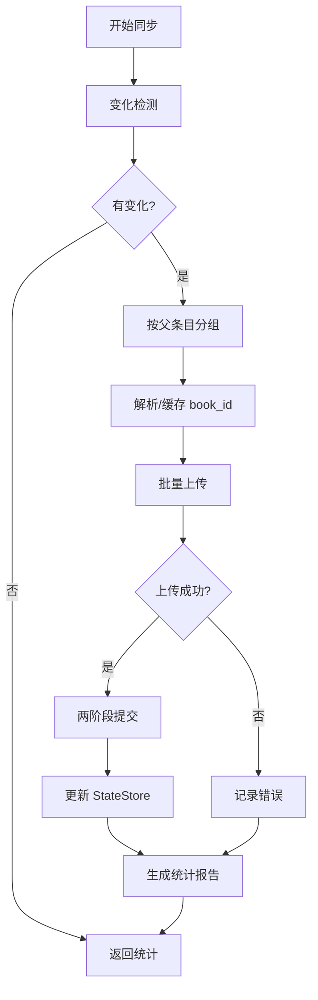

# Incremental Sync Pipeline

增量同步管线模块 - 高效批量上传优化方案

## 概述

`IncrementalSyncPipeline` 是一个高性能的增量同步管线，专门用于将 Zotero 注释批量同步到 Readwise。它实现了智能变化检测、批量上传优化、两阶段提交和详细的统计报告。

## 核心特性

### 1. 智能变化检测
- **增量扫描**：基于 `lastLibrarySyncAt` 时间戳对比
- **内容哈希**：通过哈希值检测实际内容变化
- **删除检测**：可选的删除项目追踪
- **状态缓存**：利用 StateStore 维护同步状态

### 2. 批量上传优化
- **智能分组**：按父条目自动归并注释
- **批量处理**：使用 `bulkCreateHighlights` API
- **并行上传**：支持并发批次处理
- **速率控制**：自动延迟避免 API 限流

### 3. 两阶段提交
- **事务支持**：仅在成功后更新状态
- **原子操作**：防止部分失败导致的数据不一致
- **回滚机制**：失败时自动回滚状态

### 4. 详细统计报告
- **实时进度**：提供进度回调接口
- **成功率统计**：自动计算同步成功率
- **分类统计**：按类型、来源、注释类型分类
- **错误收集**：详细的错误信息记录

## 使用方法

### 基本用法

```typescript
import { IncrementalSyncPipeline } from './core/syncPipeline';

// 创建管线实例
const pipeline = new IncrementalSyncPipeline(
  stateStore,
  readwiseClient,
  zoteroAdapter,
  mapper,
  logger
);

// 执行同步
const stats = await pipeline.executePipeline({
  incremental: true,
  batchSize: 50,
  delayBetweenBatches: 1000
});

console.log(`Synced ${stats.itemsSuccess} items successfully`);
```

### 增量同步

```typescript
// 仅同步自上次以来的更改
const stats = await pipeline.executePipeline({
  incremental: true,
  detectDeleted: true,
  libraryId: 'my-library'
});
```

### 过滤同步

```typescript
// 仅同步特定集合和标签
const stats = await pipeline.executePipeline({
  collections: ['research', 'teaching'],
  tags: ['important', 'to-review'],
  incremental: false
});
```

### 进度监控

```typescript
const stats = await pipeline.executePipeline({
  onProgress: (progress) => {
    console.log(`${progress.phase}: ${progress.percentage}%`);
    updateUI(progress);
  }
});
```

### 中止操作

```typescript
// 启动同步
const syncPromise = pipeline.executePipeline(options);

// 需要时中止
pipeline.abort();

// 处理中止
try {
  await syncPromise;
} catch (error) {
  if (error.message.includes('aborted')) {
    console.log('Sync was aborted');
  }
}
```

## API 参考

### `IncrementalSyncPipeline`

#### 构造函数

```typescript
constructor(
  stateStore: StateStore,
  readwiseClient: ReadwiseClient,
  zoteroAdapter: ZoteroAdapter,
  mapper: ZoteroToReadwiseMapper,
  logger: Logger
)
```

#### 方法

##### `executePipeline(options?: SyncPipelineOptions): Promise<SyncStatistics>`

执行同步管线。

**参数：**
- `options`: 同步选项（可选）

**返回：**
- `Promise<SyncStatistics>`: 同步统计信息

##### `getStatus(): SyncStatus`

获取当前同步状态。

**返回：**
- `SyncStatus`: 当前状态

##### `getStatistics(): SyncStatistics`

获取当前统计信息。

**返回：**
- `SyncStatistics`: 统计信息副本

##### `abort(): void`

中止当前同步操作。

### 类型定义

#### `SyncPipelineOptions`

```typescript
interface SyncPipelineOptions {
  libraryId?: string;              // 库 ID
  incremental?: boolean;            // 增量同步
  detectDeleted?: boolean;          // 检测删除
  batchSize?: number;               // 批量大小
  delayBetweenBatches?: number;    // 批次延迟
  collections?: string[];           // 集合过滤
  tags?: string[];                  // 标签过滤
  maxRetries?: number;              // 重试次数
  retryDelay?: number;              // 重试延迟
  dryRun?: boolean;                 // 试运行模式
  onProgress?: (progress) => void;  // 进度回调
}
```

#### `SyncStatistics`

```typescript
interface SyncStatistics {
  startTime: number;          // 开始时间
  endTime: number;            // 结束时间
  duration: number;           // 总耗时
  itemsSuccess: number;       // 成功数
  itemsFailed: number;        // 失败数
  itemsSkipped: number;       // 跳过数
  itemsNew: number;           // 新增数
  itemsModified: number;      // 修改数
  itemsDeleted: number;       // 删除数
  highlightsUploaded: number; // 上传高亮数
  successRate: number;        // 成功率
  errors: Error[];            // 错误列表
  details?: {...}             // 详细统计
}
```

## 工作流程



## 性能优化

### 批量处理
- 默认批量大小：50 条记录
- 可根据 API 限制调整
- 支持并发批次处理

### 缓存策略
- Book ID 缓存避免重复查询
- 内存缓存减少磁盘 I/O
- 哈希缓存加速变化检测

### 错误恢复
- 自动重试失败的批次
- 部分失败不影响其他批次
- 详细的错误日志记录

## 最佳实践

1. **定期增量同步**
   - 使用 `incremental: true` 减少数据传输
   - 配合调度器实现自动同步

2. **批量大小调优**
   - 根据网络状况调整 `batchSize`
   - 平衡速度和稳定性

3. **错误处理**
   - 监听错误事件及时处理
   - 使用重试机制提高成功率

4. **进度反馈**
   - 提供进度回调改善用户体验
   - 在 UI 中显示同步状态

5. **资源管理**
   - 及时中止不需要的同步
   - 避免同时运行多个同步任务

## 测试

运行测试套件：

```bash
npm test -- src/core/syncPipeline/test.ts
```

测试覆盖：
- ✅ 基本同步流程
- ✅ 增量同步
- ✅ 批量上传
- ✅ 过滤同步
- ✅ 试运行模式
- ✅ 中止操作
- ✅ 进度回调
- ✅ 详细统计
- ✅ 错误处理
- ✅ 状态查询

## 故障排除

### 常见问题

1. **同步速度慢**
   - 增加 `batchSize`
   - 减少 `delayBetweenBatches`
   - 启用增量同步

2. **API 限流错误**
   - 减小 `batchSize`
   - 增加 `delayBetweenBatches`
   - 实现退避策略

3. **内存占用高**
   - 减小批量大小
   - 及时清理缓存
   - 分批处理大型库

4. **状态不一致**
   - 清除并重建状态存储
   - 执行完整同步（`incremental: false`）
   - 检查事务支持

## 未来改进

- [ ] 支持断点续传
- [ ] 实现智能重试策略
- [ ] 添加冲突解决机制
- [ ] 支持双向同步
- [ ] 优化内存使用
- [ ] 添加性能指标收集

## 相关模块

- [StateStore](../../storage/stateStore/README.md) - 状态存储
- [ReadwiseClient](../../api/readwiseClient/README.md) - API 客户端
- [ZoteroAdapter](../../adapters/zoteroAdapter/README.md) - Zotero 适配器
- [Mapper](../../mappers/zoteroToReadwise/README.md) - 数据映射器
