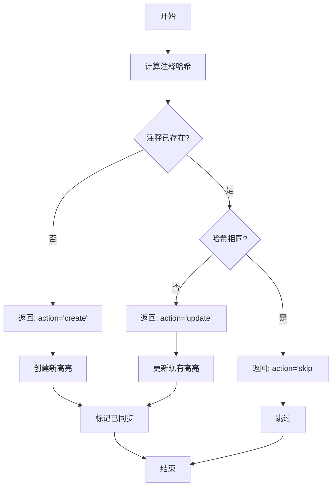

# State Store - 增量同步与去重系统

## 概述

StateStore 是 Zotero to Readwise 插件的核心组件，负责管理本地同步状态，实现增量同步和去重功能。它通过维护注释级别的细粒度状态追踪，确保只同步新增或修改的内容，避免重复提交。

## 核心功能

### 1. 注释级别的状态追踪

- **唯一标识**: 使用 `annotationKey` 作为注释的唯一标识
- **状态记录**: 为每个已同步的注释维护：
  - 内容指纹哈希 (hash)
  - Readwise 高亮 ID (readwiseHighlightId)
  - 最后同步时间 (lastSyncedAt)

### 2. 内容指纹与去重

#### 哈希计算
基于以下字段计算稳定的内容指纹：
- `annotationKey` - 注释唯一键
- `text` - 高亮文本内容
- `comment` - 用户评论
- `color` - 颜色标记
- `pageIndex` - 页码
- `parentItemKey` - 父条目键

#### 去重策略
- **新注释**: 如果 `annotationKey` 不存在于状态中 → 创建新同步
- **未修改**: 如果哈希值相同 → 跳过同步
- **已修改**: 如果哈希值不同 → 更新同步

### 3. 库级别同步跟踪

- 记录每个库的最后同步时间
- 支持按库维度的增量同步
- 格式: `libraryId → ISO timestamp`

### 4. 原子性写入

- 使用临时文件 + rename 策略
- 防止崩溃导致的状态文件损坏
- 内存缓存 + 防抖保存优化性能

## 文件结构

### 状态文件位置
```
{Zotero数据目录}/z2r-plugin/z2r-state.json
```

### 状态文件格式
```json
{
  "version": "1.0",
  "annotations": {
    "ANNO_ABC123": {
      "hash": "a1b2c3d4",
      "readwiseHighlightId": "rw_highlight_123",
      "lastSyncedAt": "2024-01-01T12:00:00.000Z"
    }
  },
  "lastLibrarySyncAt": {
    "library_001": "2024-01-01T10:00:00.000Z"
  },
  "createdAt": "2024-01-01T00:00:00.000Z",
  "lastModified": "2024-01-01T12:00:00.000Z"
}
```

## API 使用示例

### 基本使用

```typescript
import { StateStore } from './storage/stateStore';
import { Logger } from './utils/logger';

const logger = new Logger('MyApp');
const stateStore = new StateStore(logger);

// 检查注释是否需要同步
const annotation = {
  annotationKey: 'ANNO_123',
  text: 'Highlighted text',
  comment: 'My note',
  color: '#ff6666',
  pageIndex: 10,
  parentItemKey: 'ITEM_456'
};

const decision = await stateStore.needsSync(annotation);

if (decision.needsSync) {
  if (decision.action === 'create') {
    // 创建新高亮
    const readwiseId = await createHighlight(annotation);
    await stateStore.markAnnotationSynced(
      annotation.annotationKey,
      readwiseId,
      decision.currentHash
    );
  } else if (decision.action === 'update') {
    // 更新现有高亮
    await updateHighlight(decision.readwiseHighlightId, annotation);
    await stateStore.markAnnotationSynced(
      annotation.annotationKey,
      decision.readwiseHighlightId,
      decision.currentHash
    );
  }
}
```

### 批量操作

```typescript
// 批量标记注释为已同步
const records = annotations.map(ann => ({
  annotationKey: ann.key,
  readwiseHighlightId: ann.readwiseId,
  hash: stateStore.computeAnnotationHash(ann)
}));

await stateStore.batchMarkAnnotationsSynced(records);
```

### 库级别同步

```typescript
// 获取库的最后同步时间
const lastSync = await stateStore.getLibraryLastSync('library_001');

if (!lastSync || Date.now() - lastSync.getTime() > 3600000) {
  // 执行同步...
  await performSync();
  
  // 更新同步时间
  await stateStore.setLibraryLastSync('library_001', new Date());
}
```

## 同步决策流程



## 性能优化

### 内存缓存
- 状态文件在初始化时加载到内存
- 所有读取操作直接从内存返回
- 避免频繁的文件 I/O 操作

### 防抖保存
- 写入操作标记为 "dirty"
- 使用 1 秒防抖延迟
- 批量操作合并为单次写入

### 原子写入
```typescript
// 1. 写入临时文件
fs.writeFileSync(tempPath, data);

// 2. 原子重命名
fs.renameSync(tempPath, finalPath);
```

## 错误处理

### 状态文件损坏
- 自动回退到默认状态
- 记录错误日志
- 不影响插件正常运行

### 写入失败
- 清理临时文件
- 抛出错误供上层处理
- 保持内存状态不变

## 统计与监控

```typescript
// 获取同步统计
const stats = await stateStore.getAnnotationSyncStats();
console.log(`已同步注释: ${stats.totalAnnotationsSynced}`);
console.log(`状态文件大小: ${stats.stateFileSize} bytes`);
```

## 维护操作

### 清理旧记录

```typescript
// 删除单个记录
await stateStore.removeAnnotationSyncRecord('ANNO_001');

// 批量删除
await stateStore.batchRemoveAnnotationSyncRecords(['ANNO_002', 'ANNO_003']);

// 清除所有状态
await stateStore.clearAnnotationSyncState();
```

### 备份与恢复

```typescript
// 导出状态（备份）
const exportData = await stateStore.exportData();
fs.writeFileSync('backup.json', JSON.stringify(exportData));

// 导入状态（恢复）
const backupData = JSON.parse(fs.readFileSync('backup.json', 'utf-8'));
await stateStore.importData(backupData);
```

## 注意事项

1. **哈希稳定性**: 确保相同内容总是产生相同哈希
2. **原子操作**: 状态更新必须是原子的，防止部分写入
3. **向后兼容**: 保持与旧版本状态文件的兼容性
4. **性能考虑**: 大量注释时注意内存使用

## 测试

运行测试套件：

```bash
npm test src/storage/stateStore/test.ts
```

测试覆盖：
- ✅ 增量同步决策
- ✅ 批量操作
- ✅ 库级别跟踪
- ✅ 哈希稳定性
- ✅ 状态持久化
- ✅ 清理操作

## 未来改进

1. **压缩存储**: 对大型状态文件进行压缩
2. **增量备份**: 只备份变更部分
3. **PATCH 支持**: 实现真正的更新操作而非删除重建
4. **冲突解决**: 处理多设备同步冲突
5. **性能指标**: 添加同步性能追踪
